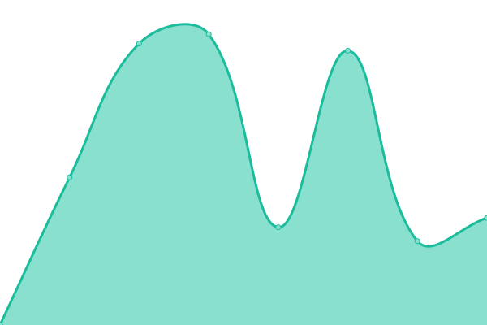
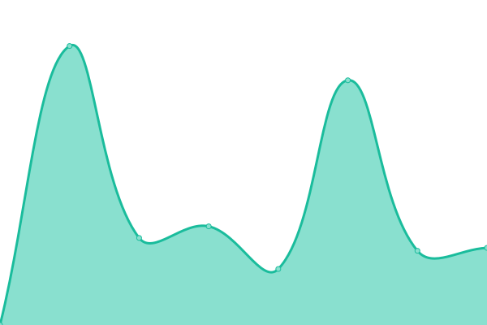

# [📈 Live Status](https://cxt666.github.io/suras): <!--live status--> **🟧 Partial outage**

This repository contains the open-source uptime monitor and status page for [Mathias](https://cxt666.github.io/suras), powered by [Upptime](https://github.com/upptime/upptime).

With [Upptime](https://upptime.js.org), you can get your own unlimited and free uptime monitor and status page, powered entirely by a GitHub repository. We use [Issues](https://github.com/cxt666/suras/issues) as incident reports, [Actions](https://github.com/cxt666/suras/actions) as uptime monitors, and [Pages](https://cxt666.github.io/suras) for the status page.

<!--start: status pages-->
<!-- This summary is generated by Upptime (https://github.com/upptime/upptime) -->
<!-- Do not edit this manually, your changes will be overwritten -->
<!-- prettier-ignore -->
| URL | Status | History | Response Time | Uptime |
| --- | ------ | ------- | ------------- | ------ |
|  [SURAS-DE](https://de-emea-vpn.schaeffler.com/vpn) | 🟩 Up | [suras-de.yml](https://github.com/cxt666/suras/commits/HEAD/history/suras-de.yml) | 

 2786ms
     
 | 

<a href="https://cxt666.github.io/suras/history/suras-de">100.00%</a>
    

|  [SURAS-DE 2](https://de-emea2-vpn.schaeffler.com/vpn) | 🟩 Up | [suras-de-2.yml](https://github.com/cxt666/suras/commits/HEAD/history/suras-de-2.yml) | 

 1865ms
     
 | 

<a href="https://cxt666.github.io/suras/history/suras-de-2">100.00%</a>
    

|  [SURAS-DE 3](https://de-emea3-vpn.schaeffler.com/vpn) | 🟩 Up | [suras-de-3.yml](https://github.com/cxt666/suras/commits/HEAD/history/suras-de-3.yml) | 

 3444ms
     
 | 

<a href="https://cxt666.github.io/suras/history/suras-de-3">100.00%</a>
    

|  [SURAS-AP](https://kr-ap-vpn.schaeffler.com/vpn) | 🟩 Up | [suras-ap.yml](https://github.com/cxt666/suras/commits/HEAD/history/suras-ap.yml) | 

 3349ms
     
 | 

<a href="https://cxt666.github.io/suras/history/suras-ap">100.00%</a>
    

|  [SURAS-CN](https://cn-ap-vpn.schaefflercn.com/vpn2f) | 🟩 Up | [suras-cn.yml](https://github.com/cxt666/suras/commits/HEAD/history/suras-cn.yml) | 

 2263ms
     
 | 

<a href="https://cxt666.github.io/suras/history/suras-cn">98.72%</a>
    

|  [SURAS-IN](https://in-ap-vpn.schaeffler.com/vpn2f) | 🟩 Up | [suras-in.yml](https://github.com/cxt666/suras/commits/HEAD/history/suras-in.yml) | 

 1916ms
     
 | 

<a href="https://cxt666.github.io/suras/history/suras-in">100.00%</a>
    

|  [SURAS-NA 1](https://us-equ1-vpn.schaeffler.com/vpn) | 🟩 Up | [suras-na-1.yml](https://github.com/cxt666/suras/commits/HEAD/history/suras-na-1.yml) | 

 2043ms
     
 | 

<a href="https://cxt666.github.io/suras/history/suras-na-1">100.00%</a>
    

|  [SURAS-NA 2](https://us-na2-vpn.schaeffler.com/vpn) | 🟥 Down | [suras-na-2.yml](https://github.com/cxt666/suras/commits/HEAD/history/suras-na-2.yml) | 

 0ms
     
 | 

<a href="https://cxt666.github.io/suras/history/suras-na-2">0.00%</a>
    

|  [SURAS-BR](https://br-sa-vpn.schaeffler.com/vpn) | 🟩 Up | [suras-br.yml](https://github.com/cxt666/suras/commits/HEAD/history/suras-br.yml) | 

 4558ms
     
 | 

<a href="https://cxt666.github.io/suras/history/suras-br">100.00%</a>
    

|  [SURAS Mobile Devices](https://mgw.schaeffler.com/mobile) | 🟩 Up | [suras-mobile-devices.yml](https://github.com/cxt666/suras/commits/HEAD/history/suras-mobile-devices.yml) | 

 1790ms
     
 | 

<a href="https://cxt666.github.io/suras/history/suras-mobile-devices">100.00%</a>
    

|  [RGW-DE](https://rgw.schaeffler.com) | 🟩 Up | [rgw-de.yml](https://github.com/cxt666/suras/commits/HEAD/history/rgw-de.yml) | 

 1293ms
     
 | 

<a href="https://cxt666.github.io/suras/history/rgw-de">100.00%</a>
    

|  [RMG](https://rmg.schaeffler.com/WebApp/user_login) | 🟩 Up | [rmg.yml](https://github.com/cxt666/suras/commits/HEAD/history/rmg.yml) | 

 821ms
     
 | 

<a href="https://cxt666.github.io/suras/history/rmg">100.00%</a>
    

<!--end: status pages-->

[**Visit our status website →**](https://cxt666.github.io/suras)

## 📄 License

- Powered by: [Upptime](https://github.com/upptime/upptime)
- Code: [MIT](./LICENSE) © [Mathias](https://cxt666.github.io/suras)
- Data in the `./history` directory: [Open Database License](https://opendatacommons.org/licenses/odbl/1-0/)
